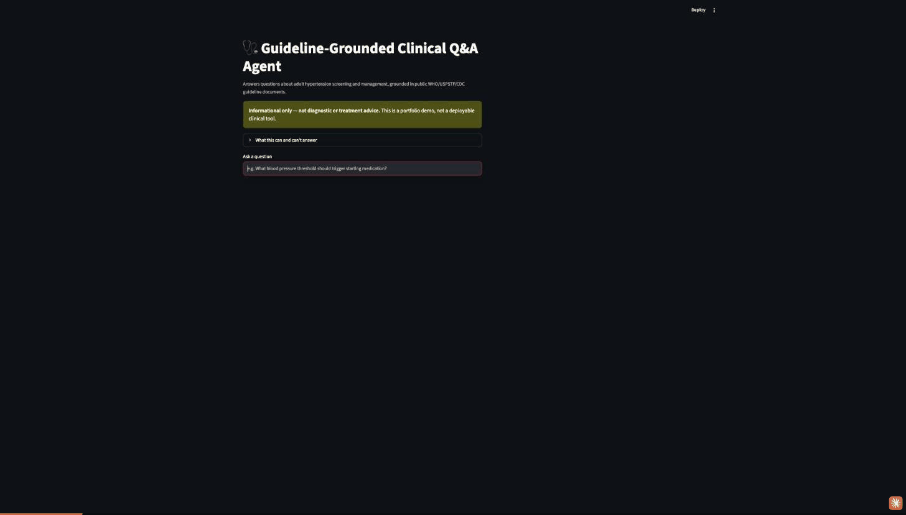

# Guideline-Grounded Clinical Q&A Agent

A retrieval-augmented (RAG) agent that answers questions over public
CDC/WHO/USPSTF clinical guideline documents, returning citation-grounded
answers and declining to answer when retrieval confidence is low or the
question falls outside the corpus's defined scope.

**Informational only — no diagnostic or treatment advice. Not a
deployable clinical tool.**



## What it does

Answers questions about **adult hypertension screening and management**,
grounded in three public guideline documents:

- WHO, *Guideline for the pharmacological treatment of hypertension in
  adults* (2021)
- USPSTF, *Screening for Hypertension in Adults* (2021 reaffirmation)
- CDC Million Hearts, *Hypertension Control Change Package* (2nd ed.)

Every answer cites the source document, publisher, and page. The agent
declines to answer — rather than guessing — in two cases:

- **Low retrieval confidence**: the question isn't well covered by the
  three documents above.
- **Out of scope by design**: hypertensive emergencies/urgencies, specific
  drug dosing, and secondary/resistant hypertension — topics the WHO
  guideline itself explicitly excludes.

## Stack

Python, LangChain, FAISS (vector store), Ollama (local LLM: `llama3.2:3b`
+ `nomic-embed-text` for embeddings), Streamlit, Docker.

## Setup

1. **Install [Ollama](https://ollama.com)** and pull the two models used
   here:
   ```bash
   ollama pull llama3.2:3b
   ollama pull nomic-embed-text
   ```
   Ollama needs to be running (`ollama serve`, or the background app) for
   both the ingestion step and the Q&A app.

2. **Create a virtualenv and install dependencies:**
   ```bash
   python -m venv .venv
   source .venv/bin/activate
   pip install -r requirements.txt
   ```

3. **The corpus and FAISS index are already included** in this repo
   (`data/raw/`, `data/faiss_index/`) — no ingestion step needed to run the
   app. To rebuild the index from scratch (e.g. after changing the
   chunking strategy), run `notebooks/01_ingest.ipynb` top to bottom.

## Usage

**Locally:**
```bash
streamlit run app/app.py
```
Opens at `http://localhost:8501`.

**Via Docker:** builds and runs the Streamlit app in a container; Ollama
itself runs on the host, not inside the container.
```bash
docker build -t clinical-qa-agent .
docker run -p 8501:8501 clinical-qa-agent
```
On Linux, add `--add-host=host.docker.internal:host-gateway` to the `run`
command (Docker Desktop on Mac/Windows resolves this automatically).

> Note: the Dockerfile follows standard practice for a Streamlit app but
> hasn't been build-tested on this machine (Docker isn't installed here).
> If `docker build` surfaces an issue, it's most likely in the
> `host.docker.internal` networking step above.

## Example Q&A

**A question the corpus covers, answered with citations:**

> **Q: What does USPSTF recommend for screening adults for high blood
> pressure?**
>
> The USPSTF recommends screening for hypertension in adults 18 years or
> older without known hypertension, with office blood pressure measurement
> (OBPM).
>
> Sources:
> 1. Screening for Hypertension in Adults (U.S. Preventive Services Task
>    Force), p. 4

**A question the guardrail declines (out of scope by design):**

> **Q: What is the dosage of amlodipine for hypertension?**
>
> This question touches on drug dosing specifics, which the underlying WHO
> guideline explicitly excludes from its scope, so this tool declines to
> answer it. This is informational only — not diagnostic or treatment
> advice.

See `notebooks/02_qa_chain.ipynb` for the full build-out of the retrieval
→ generation → citation chain and both guardrails (confidence threshold
and scope), including the empirical testing behind the threshold value and
a false-positive bug caught and fixed during testing.

## Project structure

```
app/            Streamlit app + the RAG chain/guardrail module it imports
notebooks/      Day-by-day build notebooks (ingestion, then chain+guardrails)
data/raw/       Source PDFs
data/faiss_index/  Built FAISS index
PLAN.md         Day-by-day build plan and the decisions made along the way
```
